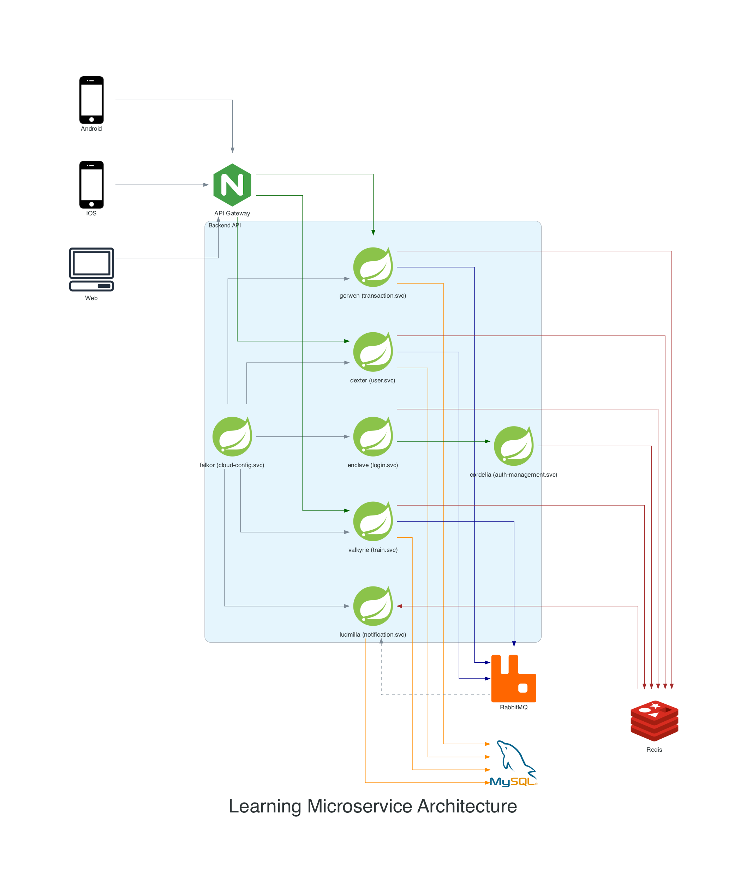
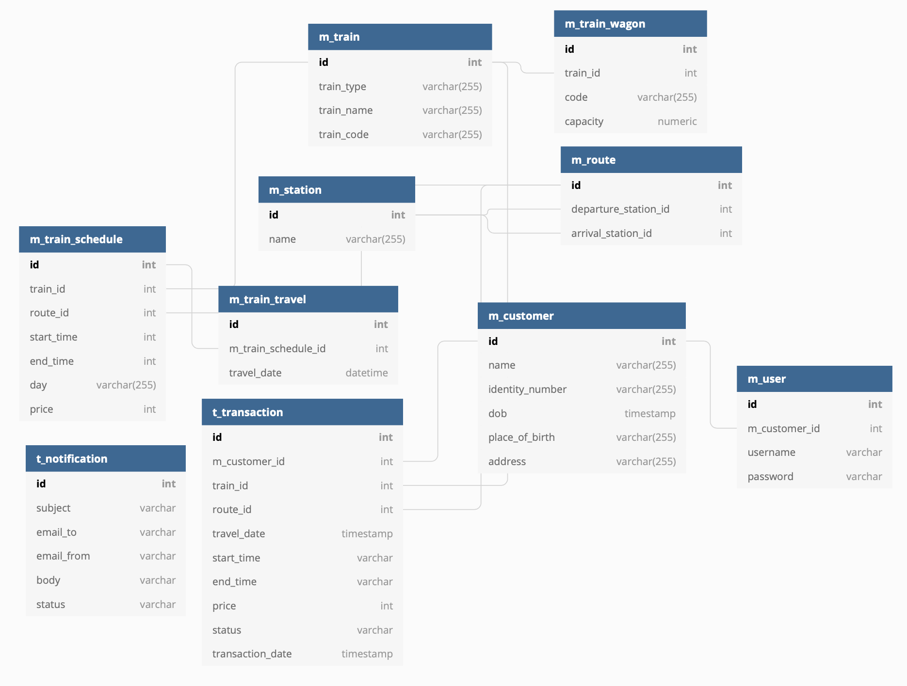

## Learning Microservice

Microservices (or microservices architecture) are a cloud native architectural approach in which a single application is composed of many loosely coupled and independently deployable smaller components, or services.

## Study Case

The case study on this project is booking tickets on the train. Reference on booking KAI tickets.

## Requirement

- JDK 11
- Maven
- MySQL Database
- Redis
- RabbitMQ
- Sonarqube
- IDEA Intelij or etc.

## Architecture

| Codename      |      Description      |
| ----------    |:-------------         |
| api-parent    | Centralize dependency management. |
| api-common    | Used for common library. |
| Falkor        | As a spring cloud configuration service used for centralized configuration server, other service consume cloud config from falkor with each codename. |
| Gorwen        | As a transaction service used to manage all of transactions in this study case. |
| Dexter        | As a user service used to manage users. |
| Cordelia      | As a authorization service used to manage authorization for each users, generate token and store token by default OAuth2. |
| Enclave       | As a login service used to validate users to access all service, call service Cordelia. |
| Valkyrie      | As a train service used to manage trains. |
| Ludmilla      | As a notification service used for notify user by email about transactions. |

## Database Design

